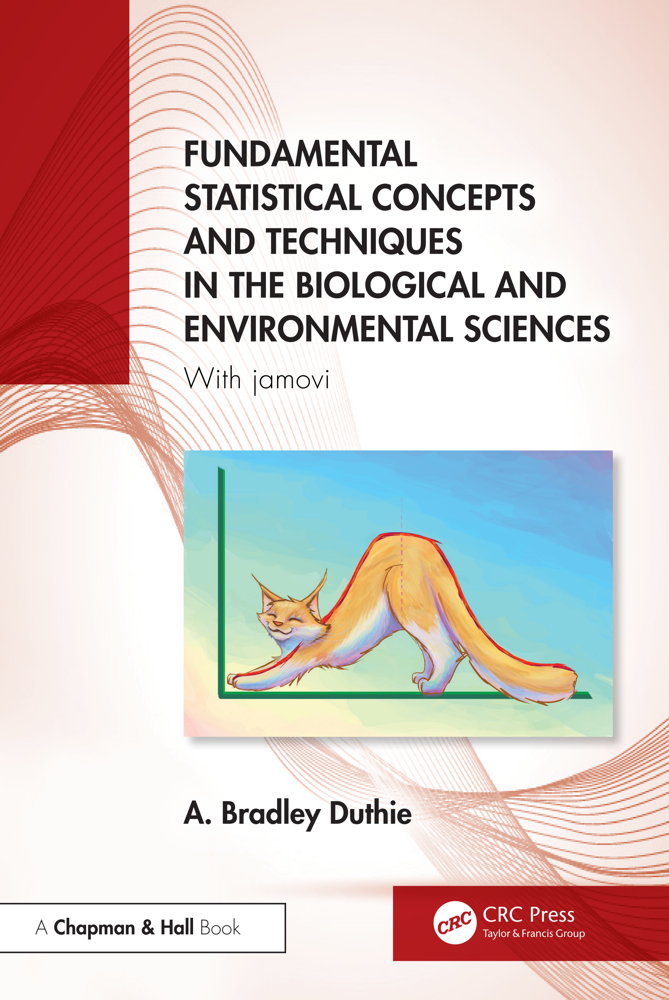

This is an introductory textbook for learning statistics. 
I originally wrote it for the second year Statistical Techniques module that I coordinate at the University of Stirling.
I wanted a freely available textbook focused on the biological and environmental sciences that used [jamovi](https://www.jamovi.org/) for module practicals.

:::: {style="display: grid; grid-template-columns: 1fr 1fr; grid-column-gap: 10px;"}

::: {}

- [Free online](https://bradduthie.github.io/stats/)
- [In print](https://www.amazon.co.uk/Fundamental-Statistical-Techniques-Biological-Environmental/dp/1032692375)
- [Audiobook](audiobook.html)
- [Shiny apps](https://bradduthie.github.io/stats/app)
- [Book data](https://osf.io/dxwyv)
- [Fpet data](petiolaris_data.html)
- [Teachers](stats_teaching.html)

:::

::: {}

:::

::::

The book starts with the very basics, so it is suitable for students with no prior knowledge of statistics and very little mathematical background.
It includes 26 chapters introducing concepts important for a foundational understanding of statistics and nine chapters on practical skills using [jamovi](https://www.jamovi.org/).
This book is [free to read](https://bradduthie.github.io/stats/) online, and you can also order a print version from [Routledge](https://www.routledge.com/Fundamental-Statistical-Concepts-and-Techniques-in-the-Biological-and-Environmental-Sciences-With-jamovi/Duthie/p/book/9781032687186) or [Amazon](https://www.amazon.co.uk/Fundamental-Statistical-Techniques-Biological-Environmental/dp/1032692375).
I am in the process of making an audio book, which will also be free to download.

