Fig wasps described in [the book](books.html) are shown below. The first image is reproduced from the appendix of [Duthie et al. (2015)](https://www.jstor.org/stable/10.1086/681621). The rest of the images I took myself and are not published anywhere else; feel free to use them for educational purposes.

![Community of fig wasps associated with *F. petiolaris* in Baja California, which is
pollinated by a wasp of the genus *Pegoscapus* (a). Five gallers shown with blue borders include
three species of *Idarnes* (b: LO1, c: SO1, d: SO2) and two species of *Heterandrium* (e: Het1, f: Het2).  Additionally, a species of *Aepocerus* (g) feeds on an inner layer of *F. petiolaris* syconia and is parasitised by a species of *Physothorax* (h). All wasps pictured developed from the same *F. petiolaris* syconium.](img/Fig1.jpg)

*Ficus petiolaris* tree pictures
--------------------------------

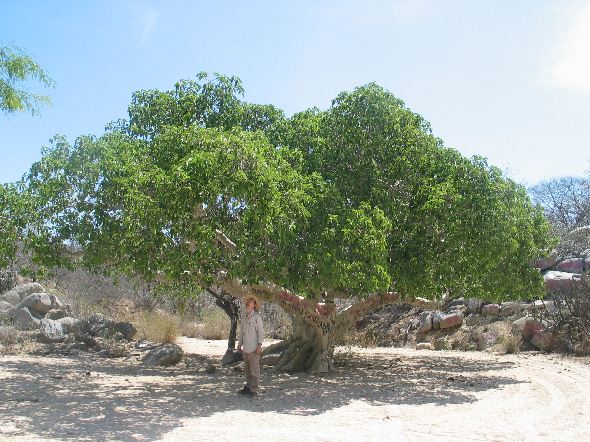

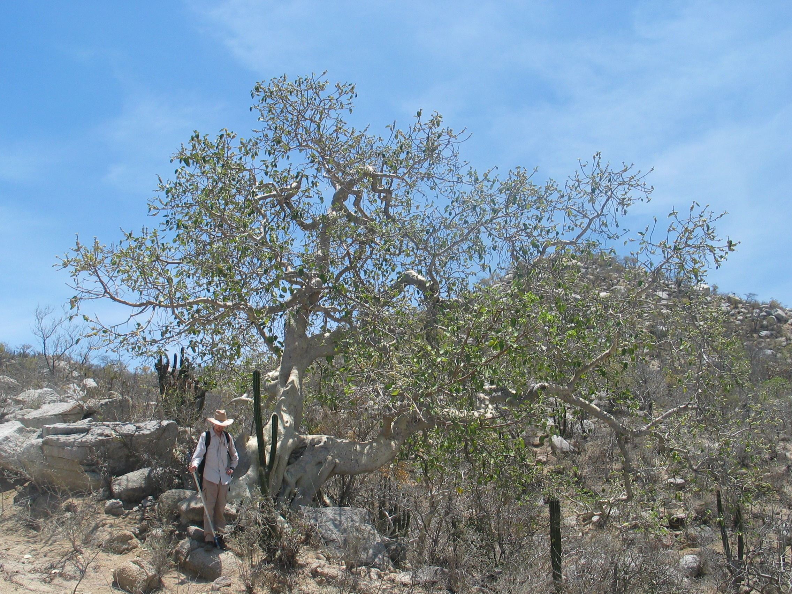

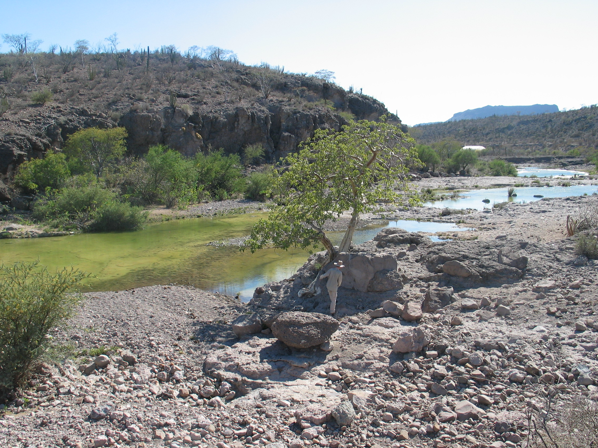

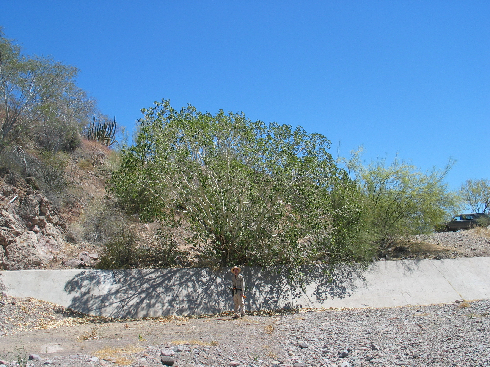

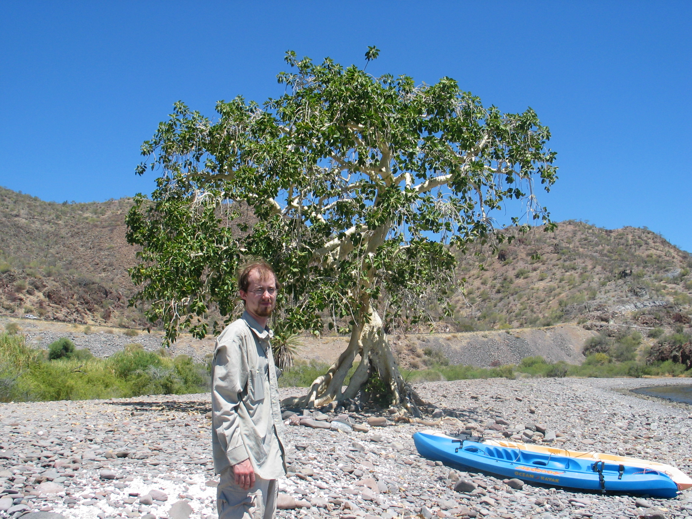

*Ficus petiolaris* root pictures
--------------------------------

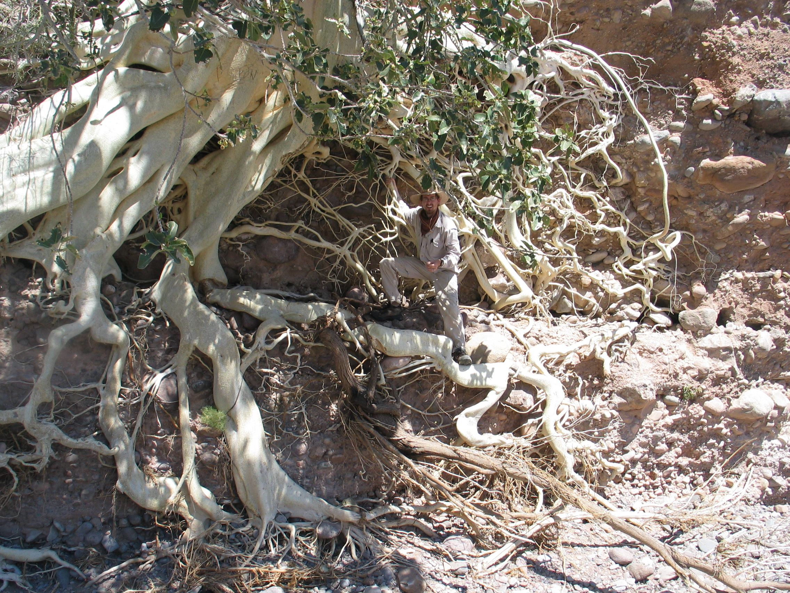

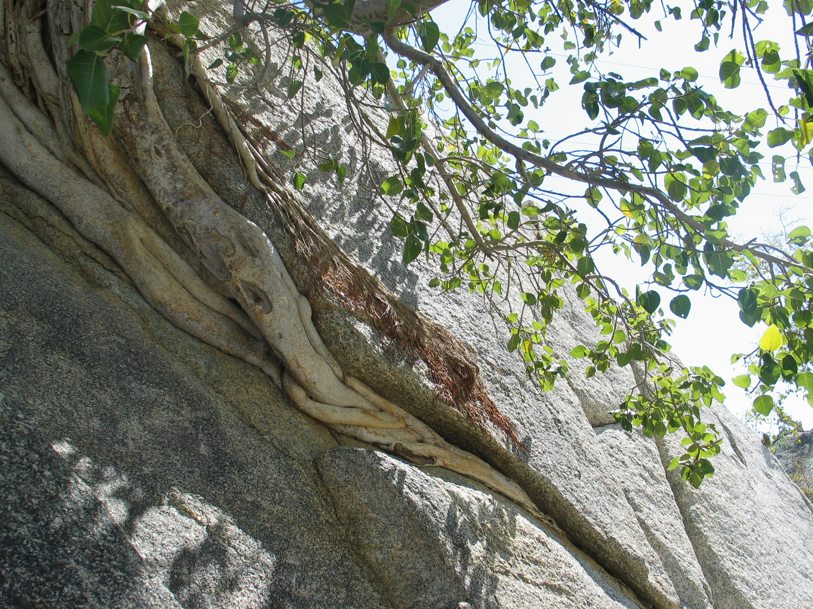

*Ficus petiolaris* syconia pictures
------------------------------

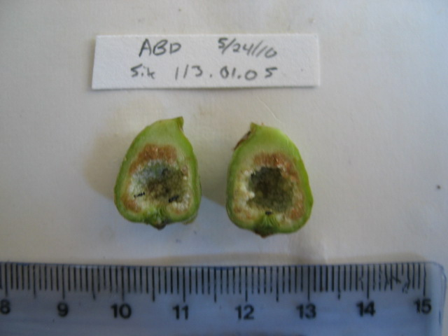

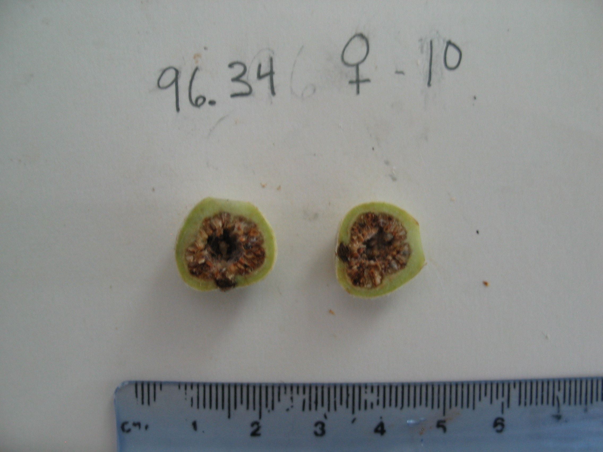

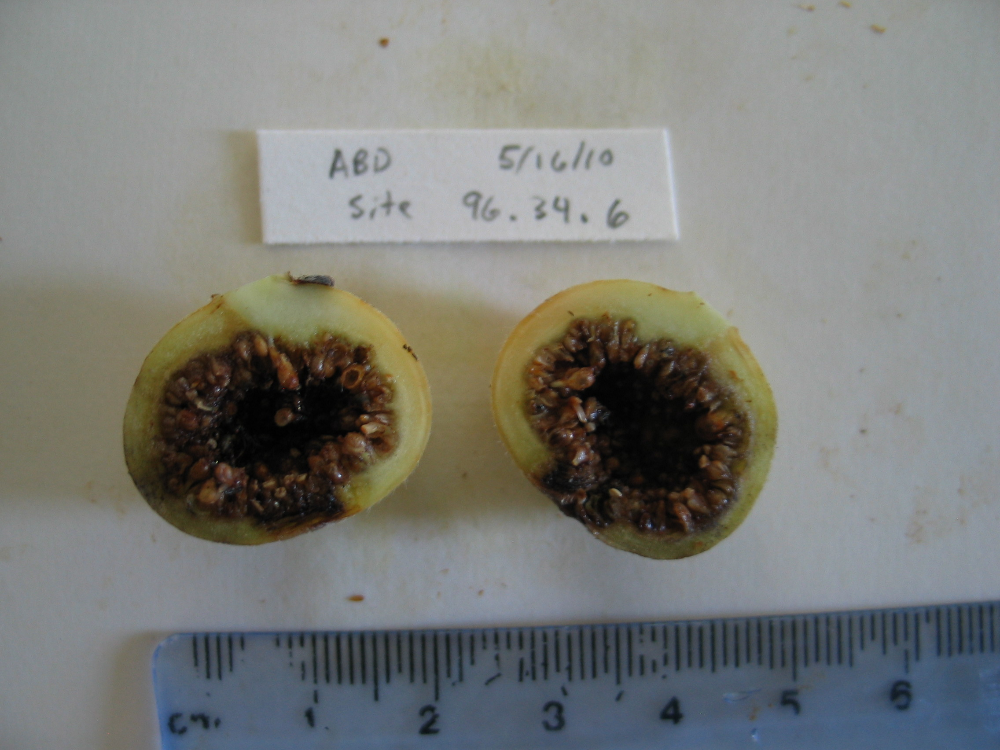

*Ficus petiolaris* habitat pictures
-----------------------------------------

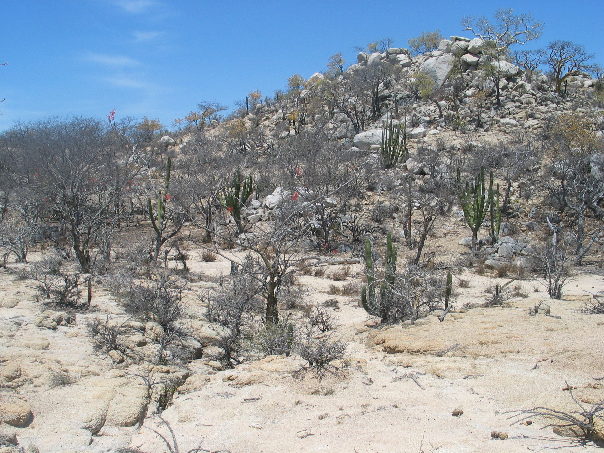

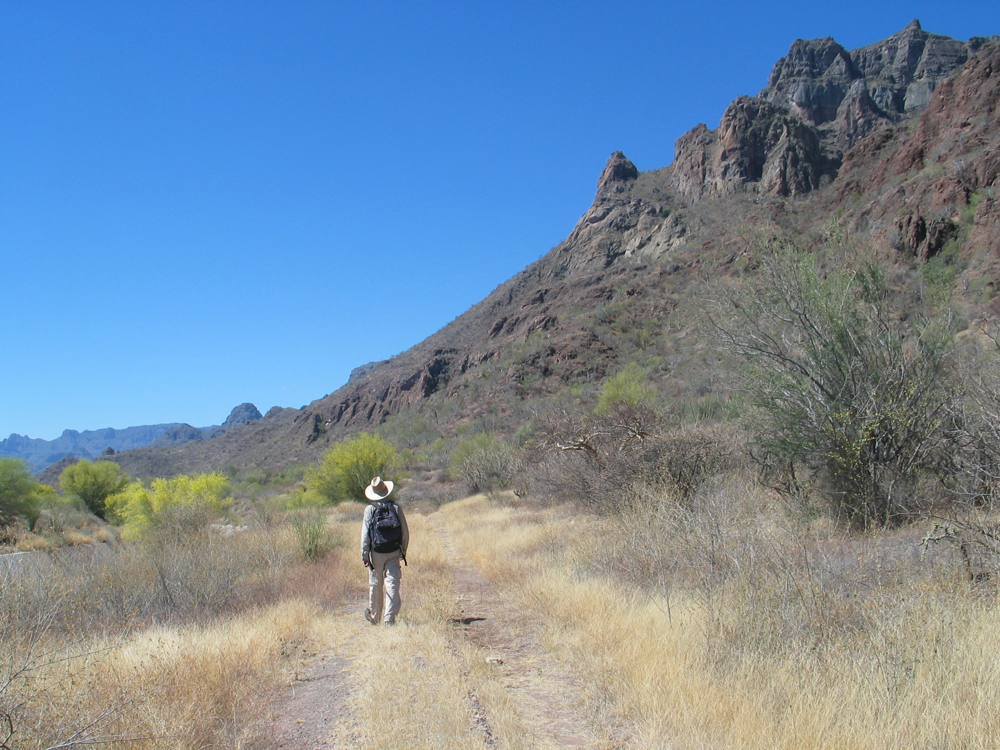

